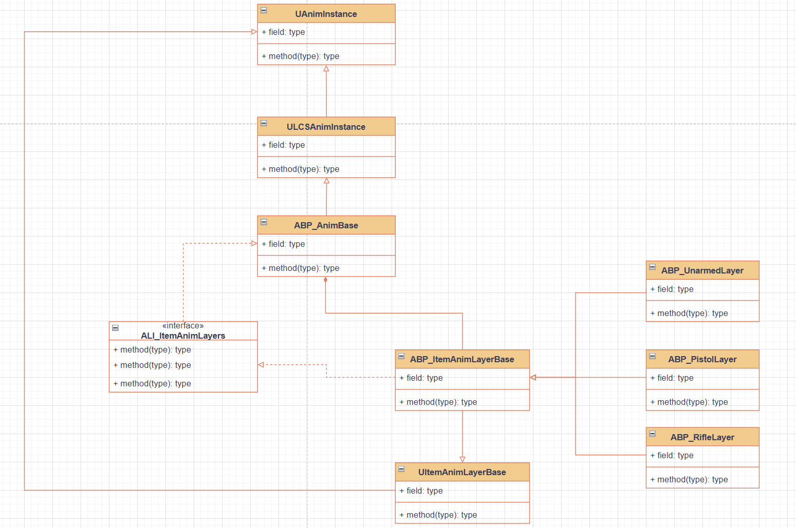

# Lyra C++ Locomotion System
本项目基于UE-5.7，使用C++复刻Lyra Starter Game的运动系统。

## 整体类结构

## 阶段性目标
- 掌握Lyra的运动系统架构设计
- 将Blueprint中数据获取和计算逻辑用C++重构
- 构建模块化、可拓展的角色运动系统

## 功能
### 基础移动

https://github.com/user-attachments/assets/191454dc-6e7c-472f-ae5f-ee76740d63a0

### 原地转身

https://github.com/user-attachments/assets/d71ff668-563f-444f-8114-d5bfb4ce29b6

### 折返跑

https://github.com/user-attachments/assets/821d518e-b257-4d8b-bf63-155593558882

### 各向运动
TODO

### 跳跃
TODO

### 蹲伏
TODO

### 姿势倾斜
TODO

### 瞄准偏移
TODO

### Stride Warping
TODO

### Foot IK
TODO
